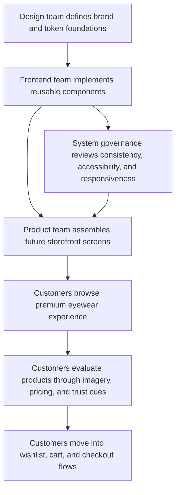

## 1. Product Overview
Khattak Eyewear needs a premium design foundation for a future 60+ screen luxury eyewear commerce platform. This phase defines the visual language, component rules, motion principles, and system governance that every future customer-facing page will inherit.

- Main purpose: create a scalable, reusable, production-ready design system that communicates luxury, trust, editorial elegance, and modern performance before any storefront screens are built.
- Market value: a unified premium foundation reduces design drift, accelerates implementation, improves conversion trust signals, and positions the brand closer to international eyewear leaders than local template-driven ecommerce sites.

## 2. Core Features

### 2.1 User Roles
| Role | Registration Method | Core Permissions |
|------|---------------------|------------------|
| Customer | No registration required for discovery | Experience a consistent premium storefront across future pages |
| Design Team | Internal access | Define and evolve visual language, tokens, patterns, and documentation |
| Frontend Team | Internal access | Build all future screens using shared tokens, components, states, and interaction rules |
| Content / Commerce Team | Internal access | Reuse approved UI structures, messaging zones, and merchandising patterns without breaking system consistency |

### 2.2 Feature Module
1. **Brand Foundation**: luxury visual principles, tone, editorial direction, trust markers, and premium interaction standards.
2. **Token System**: complete color, typography, spacing, radius, shadow, motion, and responsive tokens.
3. **Component Library**: reusable buttons, inputs, cards, navigation, overlays, states, and ecommerce utilities.
4. **Product Card Signature Pattern**: hero merchandising card with hover image, pricing hierarchy, badges, swatches, and fast actions.
5. **Interaction Framework**: Framer Motion rules, micro-interactions, hover behavior, motion hierarchy, and parallax standards.
6. **Responsive and Accessibility Rules**: desktop-first grid logic, touch behavior, keyboard navigation, contrast, and ARIA readiness.
7. **Documentation and Governance**: naming conventions, folder architecture, variant structure, and rules for future expansion.

### 2.3 Page Details
| Page Name | Module Name | Feature Description |
|-----------|-------------|---------------------|
| Design Foundation Hub | Brand Personality | Defines premium, editorial, elegant, trustworthy, and innovative brand characteristics for all future UI |
| Design Foundation Hub | Color System | Documents semantic tokens, interactive states, gradients, badges, surface tiers, and dark-mode-ready mappings |
| Design Foundation Hub | Typography System | Establishes Playfair Display for headings, Inter for body, type scale, text roles, and usage rules |
| Design Foundation Hub | Layout System | Defines container widths, 12-column desktop grid, responsive gutters, spacing rhythm, section spacing, and card padding |
| Component Catalog | Button Library | Covers primary, secondary, outline, ghost, danger, success, CTA, icon, and floating button behaviors |
| Component Catalog | Form Library | Defines text fields, selects, toggles, quantity controls, upload zones, coupon fields, validation, and status states |
| Component Catalog | Card Library | Covers product, category, brand, review, feature, statistic, dashboard, information, and empty-state cards |
| Component Catalog | Navigation System | Defines announcement bar, sticky navbar, mega menu, mobile nav, sidebar, tabs, breadcrumbs, and pagination |
| Motion Guidelines | Animation Language | Defines page transitions, reveal motions, hover choreography, loading states, and modal/drawer entrance logic |
| Motion Guidelines | Parallax Rules | Sets elegant usage for hero, floating glasses, story sections, premium collection, testimonials, and CTAs |
| Governance | Naming Convention | Standardizes token names, component variants, motion presets, and file organization for long-term scale |
| Governance | Accessibility Rules | Defines WCAG-friendly contrast, keyboard states, screen-reader support, hit-area minimums, and motion preferences |

## 3. Core Process
The future product flow starts with a customer discovering the brand through a visually refined, trust-building experience. They browse premium product collections, evaluate product details through strong imagery and clear pricing hierarchy, interact with lightweight merchandising tools such as wishlist and quick view, and move into cart and checkout flows that maintain consistency with the same design language.

For the internal team, the flow begins with selecting approved tokens and components, then composing screens from documented building blocks instead of inventing new patterns per page. New screens must inherit layout, motion, accessibility, and responsive rules from the system before release.

## 4. User Interface Design

### 4.1 Design Style
- Primary color direction: near-black `#111111` with crisp white `#FFFFFF`, soft luxury surface `#F8F9FA`, deep teal accent `#0F766E`, and refined blue accent `#2563EB`
- Button style: sculpted but minimal, medium radius, sharp typographic hierarchy, luxury hover depth, subtle motion, no noisy gradients on core actions
- Font strategy: Playfair Display for display and heading moments, Inter for body, labels, pricing support text, forms, and utility UI
- Layout style: editorial commerce with disciplined grid structure, large image-led modules, premium whitespace, and carefully controlled asymmetry
- Icon style suggestions: thin-to-regular stroke icon set with slightly softened geometry, visually aligned to luxury fashion interfaces rather than SaaS dashboards

### 4.2 Page Design Overview
| Page Name | Module Name | UI Elements |
|-----------|-------------|-------------|
| Design Foundation Hub | Hero Principle | Clean white or soft-neutral base, oversized luxury heading, restrained supporting copy, premium material cues, subtle depth |
| Design Foundation Hub | Token Tables | Semantic grouping, monochrome structure, accent highlights, border-light cards, precise spacing, documentation-friendly layout |
| Component Catalog | Product Card Showcase | Large image, lift-on-hover, image zoom, wishlist chip, quick-view affordance, price stack, swatches, stock status |
| Component Catalog | Form Showcase | Quiet surfaces, strong focus ring, reduced visual noise, readable helper/error patterns, consistent height system |
| Motion Guidelines | Animation Examples | Controlled fade, slide, scale, reveal, and parallax previews with elegant duration curves and minimal distraction |
| Governance | Folder and Naming Reference | Code-oriented tables, token prefix rules, component slot structure, and scalable variant naming examples |

### 4.3 Responsiveness
- Desktop-first system with fluid interpolation between large desktop, laptop, tablet, and mobile breakpoints
- Typography, spacing, and media blocks scale down through tokenized rules instead of ad hoc overrides
- Navigation shifts from mega-menu to compact mobile drawer without losing hierarchy or trust cues
- Touch targets remain comfortable on smaller devices while preserving a luxury feel rather than inflated consumer-app proportions

### 4.4 3D Scene Guidance (if applicable)
- No mandatory 3D for the foundation phase
- Product storytelling can later use depth through layered photography, premium shadows, parallax, and motion before considering full 3D scenes
- If 3D is introduced later, it should remain subtle, product-led, and performance-budgeted rather than decorative spectacle
