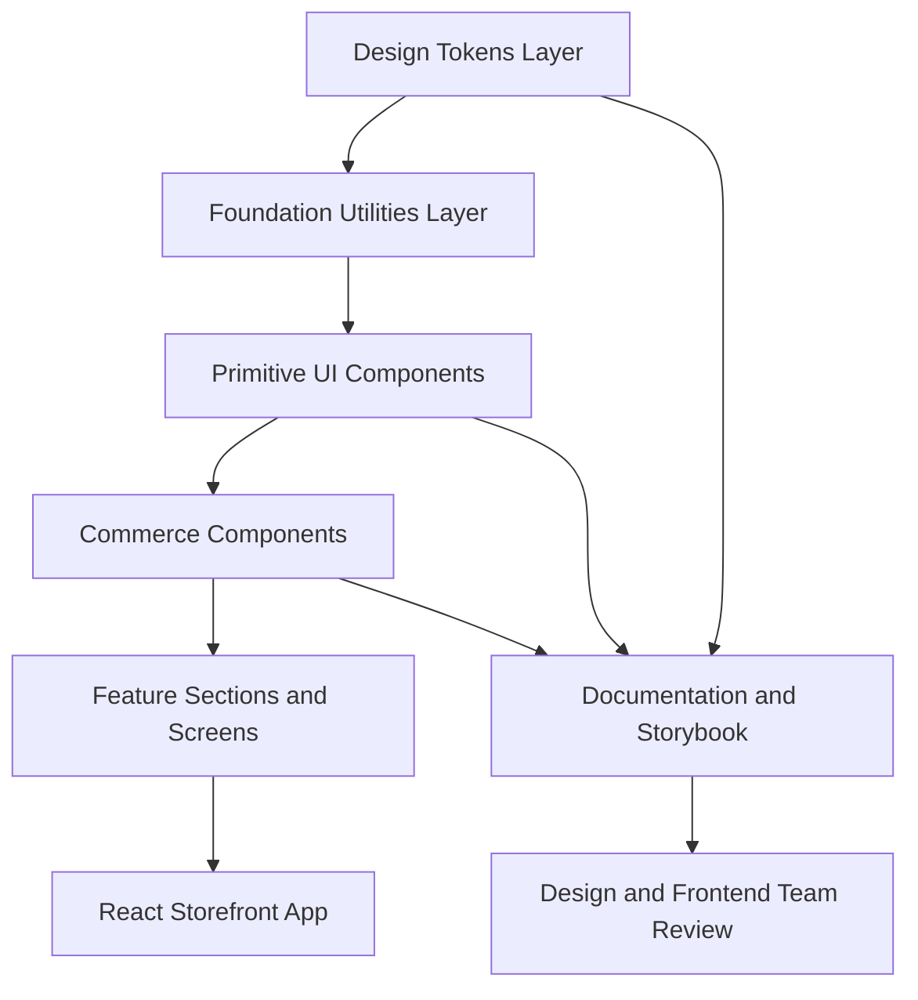
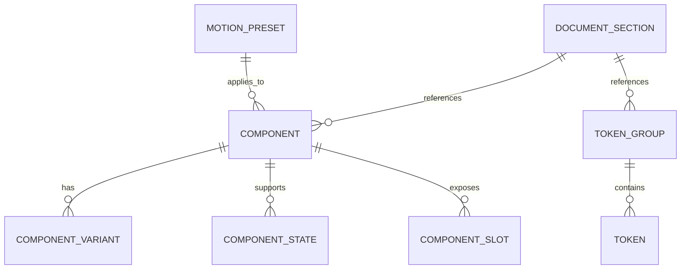

## 1. Architecture Design
The implementation should treat the design system as a product, not a loose style guide. Tokens become the single source of truth, components consume tokens through typed variants, documentation is rendered from the same source, and future storefront screens are assembled from approved primitives and commerce-specific modules.



## 2. Technology Description
- Frontend Application: React 18 + TypeScript + Vite
- Styling System: Tailwind CSS + CSS variables for semantic theming
- Motion: Framer Motion for shared motion presets and premium transitions
- Component Workbench: Storybook for isolated component development and documentation
- Variant Management: `class-variance-authority` or equivalent typed variant utility
- Icons: Lucide or a custom curated stroke icon subset wrapped in internal icon components
- Forms: React Hook Form + Zod for scalable validation and consistent field states
- State Scope: local state plus light shared state for overlays, filters, and cart previews; avoid premature global complexity
- Backend: None in the foundation phase
- Data Strategy: mock JSON / typed fixtures for component states and documentation examples
- Testing: Vitest + Testing Library for component behavior, Playwright for visual and interaction regression on critical patterns

## 3. Route Definitions
These routes represent the internal design-system and documentation workspace that should be built before the full storefront:

| Route | Purpose |
|-------|---------|
| / | Entry point for the design system overview and brand foundation |
| /foundations/colors | Semantic color tokens, gradients, and dark-mode mappings |
| /foundations/typography | Type scale, text roles, and usage guidance |
| /foundations/layout | Grid, containers, spacing, radius, and shadow system |
| /components/buttons | Button variants, states, and CTA patterns |
| /components/forms | Input, select, toggle, quantity, upload, and validation patterns |
| /components/cards | Product, category, review, feature, dashboard, and empty-state cards |
| /components/navigation | Announcement bar, navbar, mega menu, tabs, breadcrumbs, and pagination |
| /components/feedback | Toasts, alerts, badges, chips, progress, and loading states |
| /motion | Animation presets, transitions, reveal patterns, and reduced-motion behavior |
| /governance | Naming conventions, folder structure, accessibility rules, and contribution process |

## 4. API Definitions
No backend API is required in the design foundation phase. The initial system should rely on typed local data contracts so the UI can be developed, documented, and tested in isolation.

```ts
export type ColorToken = {
  name: string;
  value: string;
  usage: string;
  darkModeValue?: string;
};

export type ButtonVariant =
  | "primary"
  | "secondary"
  | "outline"
  | "ghost"
  | "danger"
  | "success"
  | "icon"
  | "floating"
  | "cta-lg"
  | "cta-sm";

export type ProductCardData = {
  id: string;
  brand: string;
  name: string;
  price: number;
  oldPrice?: number;
  rating: number;
  reviewCount: number;
  image: string;
  hoverImage?: string;
  discountLabel?: string;
  stockLabel?: string;
  colorSwatches: string[];
  isWishlisted?: boolean;
};

export type MotionPreset = {
  name: string;
  duration: number;
  easing: number[];
  reducedMotionFallback: "none" | "fade";
};
```

## 5. Server Architecture Diagram
No server architecture is required for the design foundation phase. When commerce APIs are introduced later, the UI layer should remain decoupled through typed adapters so design-system primitives do not depend directly on domain transport logic.

## 6. Data Model

### 6.1 Data Model Definition
The documentation system still benefits from structured models so tokens and components can be indexed consistently.



### 6.2 Data Definition Language
No SQL database is required yet. The first implementation should keep these definitions in TypeScript modules:

```ts
export type TokenGroup = {
  id: string;
  title: string;
  category:
    | "color"
    | "typography"
    | "spacing"
    | "radius"
    | "shadow"
    | "motion"
    | "breakpoint";
  tokens: ColorToken[];
};

export type ComponentDoc = {
  id: string;
  title: string;
  description: string;
  variants: string[];
  states: string[];
  slots: string[];
  accessibilityNotes: string[];
};
```

## 7. Reusable Component Structure
- `tokens` define raw values and semantic aliases
- `primitives` provide typography, buttons, fields, surfaces, icons, and overlays
- `patterns` compose primitives into commerce-aware modules such as product cards, filter panels, review summaries, and navigation groups
- `sections` later assemble patterns into page-level compositions without bypassing token and primitive rules

## 8. Naming Convention
- Token names: `color.text.primary`, `space.6`, `radius.lg`, `shadow.card.hover`, `motion.enter.standard`
- CSS variables: `--color-text-primary`, `--space-6`, `--radius-lg`, `--shadow-card-hover`
- Component files: `ProductCard.tsx`, `Button.tsx`, `SearchOverlay.tsx`
- Variant props: `variant`, `size`, `tone`, `state`, `elevation`
- Story names: `Components/ProductCard/Editorial`, `Foundations/Colors/Semantic`

## 9. Folder Structure for UI Components
```text
src/
  components/
    foundations/
      typography/
      icon/
      surface/
    primitives/
      button/
      input/
      checkbox/
      radio/
      select/
      badge/
      modal/
      drawer/
      tooltip/
    commerce/
      product-card/
      category-card/
      brand-card/
      quantity-stepper/
      price-badge/
      filter-panel/
      search-overlay/
      newsletter-box/
    navigation/
      announcement-bar/
      navbar/
      mega-menu/
      mobile-nav/
      breadcrumb/
      tabs/
      pagination/
    feedback/
      toast/
      alert/
      skeleton/
      empty-state/
  lib/
    tokens/
    motion/
    utils/
    fixtures/
  styles/
    globals.css
    tokens.css
  docs/
    content/
```

## 10. Engineering Rules
- Every future screen must be composed from approved components before adding one-off UI
- Styling values must come from tokens only; no arbitrary hex, spacing, shadow, or radius values inside feature components
- Each component must document states, accessibility expectations, responsive behavior, and motion usage
- Product card, navbar, filter panel, and checkout form patterns should receive the highest visual regression coverage because they influence trust and conversion most
- Dark mode readiness should exist at token level from day one even if dark mode is launched later
